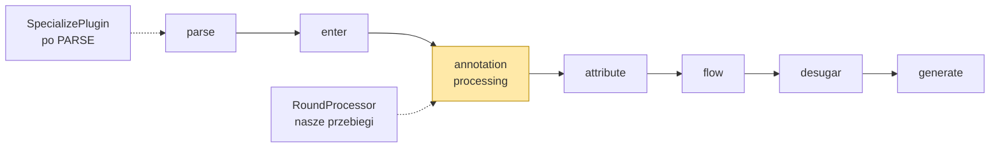
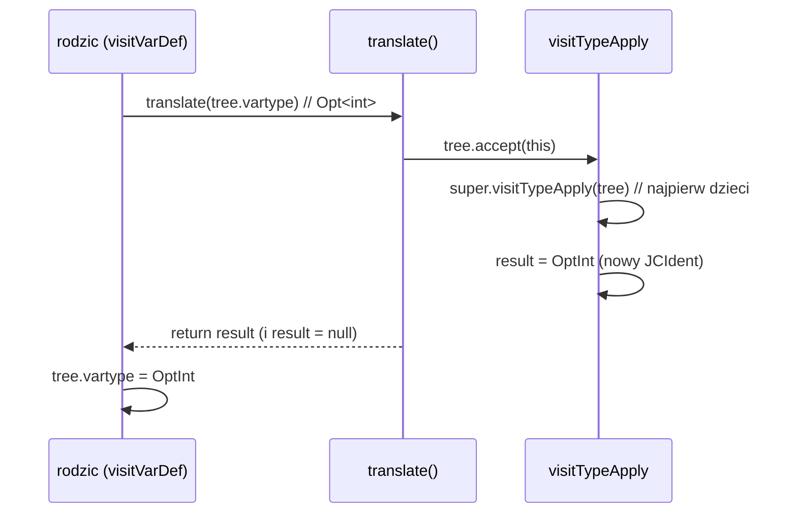
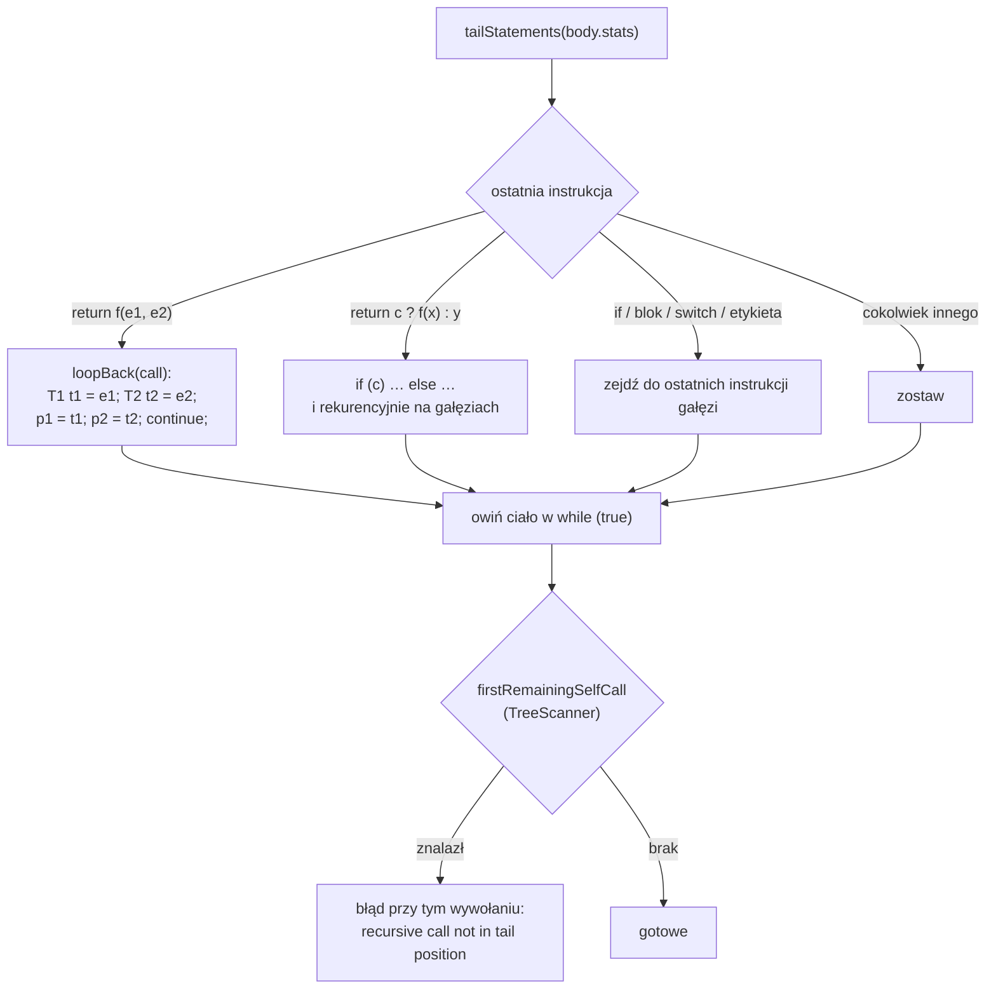
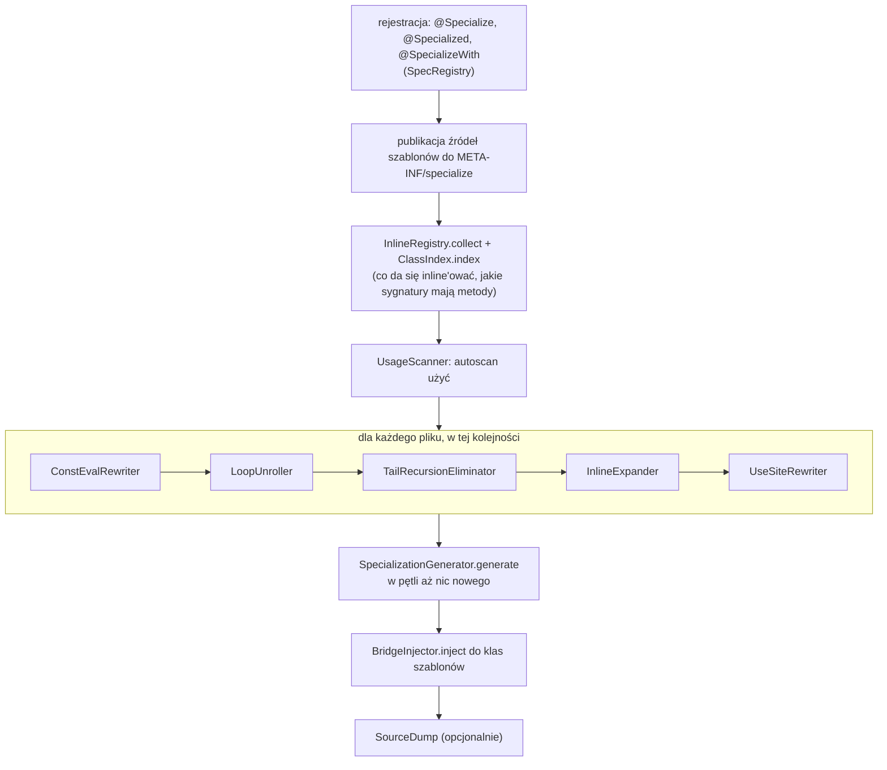
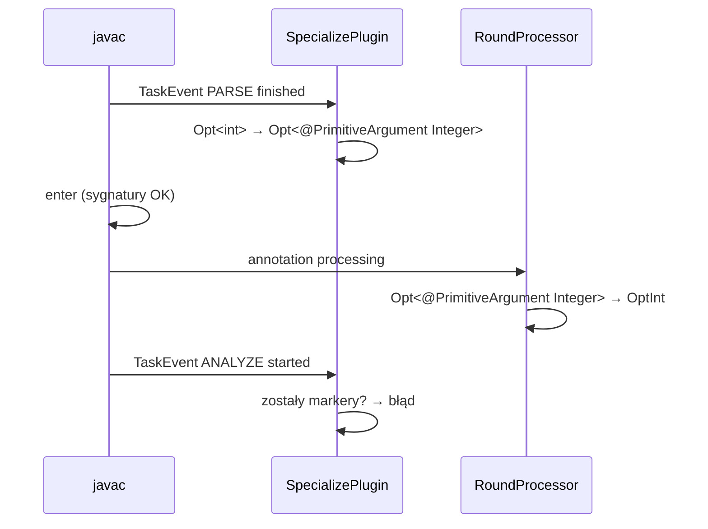

# Jak działa procesor `specialize` — tutorial

Ten dokument tłumaczy, jak przepisujemy kod w środku javac. Każda sekcja odsyła do konkretnych klas z
`specialize-processor`, więc można czytać go z otwartym kodem.

1. [Fazy javac i gdzie w nich jesteśmy](#1-fazy-javac-i-gdzie-w-nich-jesteśmy)
2. [Węzły drzewa `JCTree`](#2-węzły-drzewa-jctree)
3. [Trzy sposoby chodzenia po drzewie](#3-trzy-sposoby-chodzenia-po-drzewie)
4. [Stan w translatorze: zakresy](#4-stan-w-translatorze-zakresy)
5. [Jeden przebieg od początku do końca: `@TailRec`](#5-jeden-przebieg-od-początku-do-końca-tailrec)
6. [Kolejność przebiegów](#6-kolejność-przebiegów)
7. [Gdzie TreeTranslator nie wystarcza](#7-gdzie-treetranslator-nie-wystarcza)

---

## 1. Fazy javac i gdzie w nich jesteśmy

javac przetwarza każdy plik w stałej kolejności. Dla nas liczy się to, **co drzewo już wie** na danym etapie.



| faza | co robi javac | co widać w drzewie | my |
|---|---|---|---|
| **parse** | tekst → drzewo `JCTree` | tylko składnia: nazwy, literały, nawiasy | `SpecializePlugin` przepisuje `Opt<int>` (sekcja 7) |
| **enter** | rejestruje klasy, ich składowe i **sygnatury** w tabeli symboli | klasy i metody mają `sym`, ciała metod nadal nie | tu `Opt<int>` w sygnaturze byłoby błędem, gdyby nie plugin |
| **annotation processing** | uruchamia procesory; jeśli powstały nowe pliki, wraca do parse dla nich (kolejna *runda*) | drzewo jest mutowalne, nietypowane | **cały `RoundProcessor`** |
| **attribute** | typowanie: każdy węzeł dostaje `type` i `sym`, rozwiązuje przeciążenia, inferuje generyki | pełna semantyka | tu nasze mostki `some(int)` wygrywają przeciążenie |
| **flow** | analiza przepływu: definitywne przypisanie, osiągalność, wyjątki | | `while (true)` z `@TailRec` musi przejść tę analizę |
| **desugar** | lambdy, `switch`, enumy, boxing → prostsze konstrukcje | | |
| **generate** | bajtkod | | `ConstantValue` z `@ConstEval`, brak `goto` po `@Unroll` |

Wniosek, z którego wynika prawie wszystko dalej: **procesor dostaje drzewo przed atrybucją**. Węzeł `Opt.some(5)`
to tylko "wywołanie czegoś o nazwie `some` na czymś o nazwie `Opt`". Co oznacza `Opt` i jaki typ ma `x`, musimy
odtworzyć sami: z importów (`CompilationUnitResolver`), z deklaracji w tym samym pliku (`ClassIndex`) i z map
zmiennych, które prowadzimy w translatorach (sekcja 4). Stąd biorą się ograniczenia opisane w README.

Standardowe API procesorów (`javax.lang.model`) jest tylko do odczytu. Jak Lombok, schodzimy poziom niżej:

```java
JCClassDecl tree = (JCClassDecl) javac.trees().getTree(typeElement);   // JavacTrees, mutowalne drzewo
```

Pakiety `com.sun.tools.javac.*` nie są eksportowane z modułu `jdk.compiler`. `ModuleAccess.ensureOpen()` otwiera
je dla nas przez `Unsafe` (wywołanie `Module.implAddExports`), a gdy build podał `--add-exports`, nie robi nic.

---

## 2. Węzły drzewa `JCTree`

Wycinki poniżej pochodzą z `jdk.compiler/com/sun/tools/javac/tree/JCTree.java` (JDK 25, `lib/src.zip`), skrócone do
tego, co ma znaczenie. Cała hierarchia to **jedna klasa z ~80 klasami zagnieżdżonymi**, każda z publicznymi,
mutowalnymi polami i bez setterów. Przepisanie kodu to przypisanie do pola.

### Klasa bazowa

```java
public abstract class JCTree implements Tree, Cloneable, DiagnosticPosition {

    public int pos;                          // pozycja w źródle (błędy, make.at(pos))
    public Type type;                        // typ węzła; null aż do fazy attribute — dla nas zawsze null

    public abstract Tag getTag();            // JCTree.Tag: APPLY, SELECT, IDENT, PLUS_ASG, NEG, …
    public boolean hasTag(Tag tag)           // tag == getTag()

    public abstract void accept(Visitor v);  // wewnętrzny visitor javac (TreeScanner, TreeTranslator)
    public abstract <R,D> R accept(TreeVisitor<R,D> v, D d);   // publiczne API com.sun.source

    public String toString()                 // new Pretty(s, false).printExpr(this) — węzeł jako kod
    public JCTree setPos(int pos)
    public JCTree setType(Type type)
}
```

`Tag` jest tym, po czym rozpoznajemy operatory: `u.getTag() == JCTree.Tag.NEG` w `ConstantLoop.intLiteral`,
`INCREMENTS.get(u.getTag())` dla `i++`/`--i`, `cond.getTag()` z `{LT, LE, GT, GE, NE}` dla warunku pętli.

### Dwie klasy pośrednie

```java
public abstract static class JCStatement  extends JCTree implements StatementTree  { … }
public abstract static class JCExpression extends JCTree implements ExpressionTree { … }
```

Ważny szczegół: **typ w źródle jest wyrażeniem**. `Opt<int>` jako `vartype` to `JCTypeApply extends JCExpression`,
`int` to `JCPrimitiveTypeTree`, `String` to `JCIdent`. Dlatego ten sam `visitIdent` w `TemplateSpecializer` zamienia
`T` zarówno w `T value;` jak i w `(T) x`.

### Deklaracje

```java
public static class JCClassDecl extends JCStatement implements ClassTree {
    public JCModifiers mods;                 // adnotacje i flagi (Flags.STATIC, Flags.FINAL, Flags.RECORD …)
    public Name name;
    public List<JCTypeParameter> typarams;   // <T>  — TemplateSpecializer usuwa stąd podstawione parametry
    public JCExpression extending;
    public List<JCExpression> implementing;
    public List<JCExpression> permitting;
    public List<JCTree> defs;                // pola, metody, klasy zagnieżdżone — TU wstrzykujemy mostki
    public ClassSymbol sym;                  // null przed enter; my go nie używamy
    public void accept(Visitor v) { v.visitClassDef(this); }
}

public static class JCMethodDecl extends JCTree implements MethodTree {
    public JCModifiers mods;
    public Name name;
    public JCExpression restype;             // typ zwracany (null dla konstruktora)
    public List<JCTypeParameter> typarams;   // static <T> — dla nas "T szablonu" w metodzie statycznej
    public JCVariableDecl recvparam;
    public List<JCVariableDecl> params;
    public List<JCExpression> thrown;
    public JCBlock body;                     // null dla abstract/native — @TailRec i @Inline to sprawdzają
    public JCExpression defaultValue;        // tylko w adnotacjach
    public MethodSymbol sym;
    public void accept(Visitor v) { v.visitMethodDef(this); }
}

public static class JCVariableDecl extends JCStatement implements VariableTree {
    public JCModifiers mods;
    public Name name;
    public JCExpression vartype;             // null dla `var` — SourceRenderer wstawia Ident("var")
    public JCExpression init;                // @ConstEval podmienia to na literał
    public VarSymbol sym;
    public void accept(Visitor v) { v.visitVarDef(this); }
}
```

Pole i parametr metody to ta sama klasa `JCVariableDecl`; rozróżnia je `mods.flags & Flags.PARAMETER` i miejsce
w drzewie.

### Wyrażenia, których używamy najczęściej

```java
public static class JCIdent extends JCExpression {              // x, T, Opt
    public Name name;
    public Symbol sym;
    public void accept(Visitor v) { v.visitIdent(this); }
}

public static class JCFieldAccess extends JCExpression {        // Opt.some, this.x, java.util.List
    public JCExpression selected;            // lewa strona kropki
    public Name name;                        // prawa strona kropki — to jest Name, nie JCIdent!
    public void accept(Visitor v) { v.visitSelect(this); }
}

public static class JCTypeApply extends JCExpression {          // Opt<int>, Map2<K, V>
    public JCExpression clazz;               // Opt
    public List<JCExpression> arguments;     // [int]
    public void accept(Visitor v) { v.visitTypeApply(this); }
}

public static class JCMethodInvocation extends JCPolyExpression { // Opt.<int>some(5)
    public List<JCExpression> typeargs;      // [int]   (List.nil() gdy brak)
    public JCExpression meth;                // JCFieldAccess(Opt, some) albo JCIdent(some)
    public List<JCExpression> args;          // [5]
    public void accept(Visitor v) { v.visitApply(this); }     // uwaga: visitApply, nie visitMethodInvocation
}

public static class JCForLoop extends JCStatement {
    public List<JCStatement> init;           // int i = 0
    public JCExpression cond;                // i < 8
    public List<JCExpressionStatement> step; // i++
    public JCStatement body;
    public void accept(Visitor v) { v.visitForLoop(this); }
}
```

Dwie rzeczy, które na początku zaskakują:

* Nazwa kwalifikowana `dev.specialize.Prim` to łańcuch `JCFieldAccess(JCFieldAccess(JCIdent(dev), specialize), Prim)`.
  `TreeUtil.flatten(tree)` składa go z powrotem w `String`; `TreeUtil.qualIdent(make, names, "a.b.C")` buduje w drugą
  stronę.
* `JCFieldAccess.name` i `JCMethodInvocation.meth` to nie to samo: w `Opt.some(5)` pole `meth` to
  `JCFieldAccess(selected = Ident(Opt), name = some)`. Kiedy `Retargeter` chce zmienić `Opt.some` na `OptInt.some`,
  podmienia tylko `access.selected`.

### Visitor, na którym stoi wszystko

```java
public abstract static class Visitor {
    public void visitTopLevel(JCCompilationUnit that) { visitTree(that); }
    public void visitClassDef(JCClassDecl that)       { visitTree(that); }
    public void visitMethodDef(JCMethodDecl that)     { visitTree(that); }
    public void visitVarDef(JCVariableDecl that)      { visitTree(that); }
    public void visitForLoop(JCForLoop that)          { visitTree(that); }
    public void visitApply(JCMethodInvocation that)   { visitTree(that); }
    public void visitSelect(JCFieldAccess that)       { visitTree(that); }
    public void visitIdent(JCIdent that)              { visitTree(that); }
    public void visitTypeApply(JCTypeApply that)      { visitTree(that); }
    // … jedna metoda na typ węzła, ~70 sztuk
    public void visitTree(JCTree that)                { Assert.error(); }
}
```

Klasyczny podwójny dispatch: `tree.accept(v)` wywołuje `v.visitX(tree)` właściwe dla klasy węzła. `TreeScanner` i
`TreeTranslator` (sekcja 3) to po prostu dwa różne zestawy domyślnych implementacji tych metod.

### Narzędzia obok drzewa

* **`TreeMaker`** tworzy węzły: `make.Ident(name)`, `make.Apply(typeargs, meth, args)`, `make.Block(0, stats)`,
  `make.Literal(TypeTag.INT, 5)`, `make.TypeIdent(TypeTag.INT)`, `make.NewArray(elemtype, dims, elems)`.
  `make.at(pos)` ustawia `pos` dla kolejnych węzłów, żeby błędy javac wskazywały właściwą linię, dlatego prawie
  każdy nasz `visitX` zaczyna się od `make.at(tree.pos)`.
* **`TreeCopier`** robi głęboką kopię: `new TreeCopier<Void>(make).copy(tree)`. Kopia szablonu w
  `TemplateSpecializer.specialize`, kopia ciała na każdą iterację w `LoopUnroller.iteration`.
* **`com.sun.tools.javac.util.List`** to lista wiązana (`head`, `tail`, `nonEmpty()`, `append`, `prepend`,
  `List.from(collection)`, `List.nil()`), nie `java.util.List`. Jest "prawie niemutowalna": `append` zwraca nową
  listę, ale pole `head` jest publiczne i `TreeTranslator.translate(List)` z niego korzysta (sekcja 3b).
* **`Names`** internuje nazwy: `names.fromString("some")`, `names._this`, `names._class`. Porównania `id.name == tvar`
  są przez `==`, bo `Name` jest internowany.
* **`Flags`** to bity modyfikatorów: `(m.mods.flags & Flags.STATIC) != 0`, `Flags.GENERATEDCONSTR` (konstruktor
  dopisany przez javac, który usuwamy z kopii szablonu), `Flags.RECORD`, `Flags.VARARGS`.

---

## 3. Trzy sposoby chodzenia po drzewie

Każdy węzeł ma metodę `accept(Visitor v)`, która wywołuje `v.visitX(this)` dla swojego typu. javac dostarcza dwie
gotowe klasy bazowe, z których korzystamy, i jedną publiczną, z której nie.

### 3a. `TreeScanner`: tylko czytanie

```java
public class TreeScanner extends Visitor {
    public void scan(JCTree tree)            // null-safe: tree.accept(this)
    public void scan(List<? extends JCTree>) // scan dla każdego elementu
    public void visitForLoop(JCForLoop tree) { scan(tree.init); scan(tree.cond); scan(tree.step); scan(tree.body); }
    // …i tak dla każdego typu węzła
}
```

Domyślna implementacja każdego `visitX` po prostu schodzi do dzieci. Nadpisujesz te metody, które Cię interesują,
zbierasz informacje w polach i **wywołujesz `super`**, żeby nie urwać schodzenia. Jeśli `super` pominiesz, poddrzewo
jest niewidoczne, co czasem jest celem: `LoopBodyCheck` nie wchodzi do lambd i klas anonimowych, bo `break` nie może
przez nie przeskoczyć.

Przykład z naszego kodu, `LoopBodyCheck` (sprawdza, czy ciało pętli można skopiować):

```java
static Optional<String> problem(JCStatement body, Name variable, Optional<Name> label) {
    LoopBodyCheck check = new LoopBodyCheck(variable, label);
    check.scan(body);
    return check.problem;
}

@Override
public void visitBreak(JCBreak tree) {
    if (tree.label == null ? breakTargets == 0 : label.filter(tree.label::equals).isPresent()) {
        problem = Optional.of("a break leaves the loop");
    }
}

@Override
public void visitForLoop(JCForLoop tree) {          // zagnieżdżona pętla: jej break nie dotyczy nas
    nested(() -> super.visitForLoop(tree), true);
}
```

Inne skanery u nas: `UsageScanner` (autoscan: zbiera `Opt<Integer>`, `Opt.<long>m()`), `ExitScanner` w `Retargeter`
(znajduje `return`/`yield` lambdy bez wchodzenia w zagnieżdżone lambdy), `firstRemainingSelfCall` w `@TailRec`.

### 3b. `TreeTranslator`: czytanie i podmiana

Prawdziwy kod (`TreeTranslator.java`, bez komentarzy) jest krótki i warto go znać dosłownie:

```java
public class TreeTranslator extends JCTree.Visitor {
    protected JCTree result;                              // <- CAŁA magia

    public <T extends JCTree> T translate(T tree) {
        if (tree == null) return null;
        tree.accept(this);                                // wywoła visitX, które ustawi result
        JCTree tmpResult = this.result;
        this.result = null;                               // wyzerowane po każdym węźle
        return (T) tmpResult;
    }

    public <T extends JCTree> List<T> translate(List<T> trees) {
        if (trees == null) return null;
        for (List<T> l = trees; l.nonEmpty(); l = l.tail)
            l.head = translate(l.head);                   // w miejscu: podmienia head każdej komórki
        return trees;                                     // ta sama lista
    }

    public void visitIf(JCIf tree) {                      // domyślna implementacja dla każdego węzła:
        tree.cond = translate(tree.cond);                 // przetłumacz dzieci i przypisz je z powrotem,
        tree.thenpart = translate(tree.thenpart);         // potem zgłoś siebie jako wynik
        tree.elsepart = translate(tree.elsepart);
        result = tree;
    }
}
```

Protokół jest prosty, ale trzeba go znać na pamięć:

1. `translate(dziecko)` wywołuje `visitX` dziecka.
2. `visitX` **musi** ustawić `result`: na ten sam węzeł (nic się nie zmieniło) albo na nowy (podmiana).
3. Rodzic przypisuje zwrócony `result` z powrotem do swojego pola: `tree.body = translate(tree.body)`.



Wzorzec, który zobaczysz w każdym naszym translatorze:

```java
@Override
public void visitTypeApply(JCTypeApply tree) {                     // UseSiteRewriter
    super.visitTypeApply(tree);                                    // 1. dzieci: List<Opt<int>> → argumenty najpierw
    make.at(tree.pos);
    Optional<Specialization> spec = specFor(tree.clazz, tree.arguments);
    result = spec.<JCExpression>map(s -> specType(s, tree.arguments)).orElse(tree);   // 2. Opt<int> → OptInt albo bez zmian
}
```

Trzy pułapki, które wynikają wprost z kodu wyżej:

* `translate` zeruje `result` po każdym węźle. Jeśli Twój `visitX` go nie ustawi, rodzic dostanie **`null`** i
  wstawi go w drzewo; javac wysypie się dużo później, w zupełnie innym miejscu. Dlatego każdy nasz `visitX` kończy
  się `result = …`, także gdy niczego nie zmienia (patrz `visitMethodDef` w `TailRecursionEliminator`).
* `translate(List)` modyfikuje listę **w miejscu** (`l.head = …`) i zwraca tę samą referencję. Nie da się nią
  dodać ani usunąć elementów; kiedy chcemy zmienić długość (usunąć konstruktor dopisany przez javac, dodać mostki),
  budujemy nową listę: `copy.defs = List.from(copy.defs.stream().filter(…).toList())`,
  `cd.defs = cd.defs.appendList(added)`.
* Domyślne `visitX` tłumaczy **wszystkie** dzieci, także te, których nie chcesz ruszać. `LoopVariableSubstituter`
  nadpisuje `visitApply`, żeby nie tłumaczyć `meth`, bo metoda o nazwie `i` nie jest zmienną pętli `i`.

Translatory u nas: `PrimitiveArgumentRewriter`, `ConstEvalRewriter`, `LoopUnroller`, `LoopVariableSubstituter`,
`TailRecursionEliminator`, `InlineExpander`, `UseSiteRewriter`, `TemplateSpecializer`.

### 3c. `TreeVisitor` / `SimpleTreeVisitor`: publiczne API, tylko do czytania

`com.sun.source.util.TreeScanner` i `SimpleTreeVisitor` pracują na interfejsach `com.sun.source.tree.*`, które nie
mają setterów. Nadają się do lintów i pluginów, nie do przepisywania. Nie używamy ich.

### 3d. Kiedy który

| potrzeba | narzędzie | przykład u nas |
|---|---|---|
| policzyć / znaleźć / zweryfikować | `TreeScanner` | `LoopBodyCheck`, `UsageScanner` |
| podmienić węzły w miejscu | `TreeTranslator` | `UseSiteRewriter` |
| zbudować nową klasę z istniejącej | `TreeCopier` + `TreeTranslator` na kopii | `TemplateSpecializer.specialize` |
| przepisać kawałek bez wizytora | ręcznie po polach (`stats`, `defs`) | `TailRecursionEliminator.Rewrite` |

---

## 4. Stan w translatorze: zakresy

Translator to zwykły obiekt, więc "zakres" (co widać w tym miejscu programu) symulujemy zapisując i przywracając
pola przy wejściu i wyjściu z węzła. Jest to tańsze niż budowanie własnej tabeli symboli i wystarcza, bo
patrzymy tylko na deklaracje.

```java
@Override
public void visitMethodDef(JCMethodDecl tree) {                    // UseSiteRewriter
    …
    Optional<Specialization> savedReturn = returnSpec;
    Map<Name, Specialization> savedDeclared = declared;
    declared = new HashMap<>(declared);                            // parametry i lokalne tej metody
    returnSpec = Optional.ofNullable(tree.restype).flatMap(this::specOfType);
    tree.body = translate(tree.body);
    returnSpec = savedReturn;                                      // wyjście z zakresu
    declared = savedDeclared;
    result = tree;
}
```

Te same pola, różne przebiegi:

| pole | klasa | co koduje |
|---|---|---|
| `declared` (w rekordzie `Scope`) | `UseSiteRewriter` | nazwa → specjalizacja, żeby `x = Opt.empty()` wiedziało, w co przepisać `empty()` |
| `returnSpec` (w `Scope`), `lambdaDepth` | `UseSiteRewriter`, `TemplateSpecializer` | `return` w lambdzie nie jest `return`em metody |
| `shadowed` | `TemplateSpecializer` | klasa zagnieżdżona z własnym `T` zasłania `T` szablonu |
| `substitution` (rekord `Substitution`) | `TemplateSpecializer` | `K → int`, `V` zostaje (szablony wieloparametrowe) |
| `pendingLabel` | `LoopUnroller` | etykieta `outer:` należy do pętli bezpośrednio pod nią |
| `localDepth` | `ConstEvalRewriter` | pole klasy lokalnej/anonimowej nie ma nazwy binarnej, którą da się załadować |

Jedna subtelność: pola klasy są widoczne **przed** deklaracją (konstruktor może przypisać `this.f` zanim wizytor
dojdzie do pola). Dlatego `visitClassDef` robi prescan pól i dopiero potem schodzi w metody.

---

## 5. Jeden przebieg od początku do końca: `@TailRec`

`TailRecursionEliminator` to `TreeTranslator`, ale nie podmienia węzłów podczas wizyty. Wizyta służy tylko do
znalezienia metody z adnotacją; właściwa robota dzieje się na liście instrukcji ciała.

```java
@Override
public void visitMethodDef(JCMethodDecl tree) {
    super.visitMethodDef(tree);
    if (TreeUtil.hasAnnotation(tree.mods.annotations, "TailRec")) {
        validate(tree).ifPresentOrElse(problem -> diagnostics.error(tree, "@TailRec " + tree.name + ": " + problem),
                () -> new Rewrite(tree).apply());
    }
    result = tree;
}
```

`validate` odrzuca to, co odrzuca Scala: metoda musi być `static`, `private` lub `final` (albo klasa `final`),
bez przeciążenia tej samej arności, bez `final` parametrów. Potem `Rewrite.apply()`:



Najważniejsze sygnatury:

```java
private List<JCStatement> tailStatements(List<JCStatement> statements)  // ostatnia instrukcja listy
private JCStatement tailStatement(JCStatement statement)               // switch po typie węzła (pattern matching)
private JCStatement tailReturn(JCReturn ret)                            // rozbija ?: na if, rozpoznaje self call
private JCStatement loopBack(JCMethodInvocation call)                   // temporaria + przypisania + continue
private boolean isSelfCall(JCExpression expression)                     // f(..), this.f(..), Owner.f(..)
```

Temporaria są konieczne: `return swap(b, a)` bez nich przypisałoby `a = b`, a potem `b = a` z już nadpisanym `a`.
Efekt widać w `specialize-examples/build/specialize-dump/dev/specialize/examples/MathX.java`:

```java
public static long gcd(long a, long b) {
    while (true) {
        if (b == 0) { return a; }
        { long a$tail0 = b; long b$tail1 = a % b; a = a$tail0; b = b$tail1; continue; }
    }
}
```

Dla metody `void` ostatnia instrukcja może być samym `f(x);` (bez `return`), a gdy ciało kończy się zwykłą
instrukcją, dopisujemy `return;`, żeby nie zapętlić się przez `while (true)`.

---

## 6. Kolejność przebiegów

`RoundProcessor.process(RoundEnvironment round)` wykonuje jedną rundę procesowania:



Dlaczego tak:

* `@ConstEval` pierwszy, bo kompiluje **oryginalny tekst pliku** na boku i wstawia literały; nie może zależeć od
  naszych późniejszych przepisań.
* `@Unroll` przed `@Inline`: po rozwinięciu `sq(i)` dostaje literał, `@Inline` wstawia `(3 * 3)`, javac składa `9`.
* `@TailRec` przed `@Inline`, bo inline mógłby zamienić `return f(x)` w blok i ukryć pozycję ogonową.
* `UseSiteRewriter` ostatni: widzi kod już po inline'ach, więc `Opt<int> a = …` wstawione przez inline też się
  specjalizuje.
* Generowanie w pętli: `OptCodecInt` używa `Opt<int>`, więc jego wygenerowanie może zażądać `OptInt`. Każdy nowy plik
  źródłowy wywołuje zresztą kolejną rundę javac, w której cały ten proces uruchamia się dla nowych plików.
* Mostki na końcu, bo ich sygnatury (`static OptInt some(int)`) muszą przejść przez `UseSiteRewriter` i muszą już
  istnieć wszystkie specjalizacje, do których delegują.

Kluczowe sygnatury tego etapu:

```java
Optional<SourceTemplate> SpecRegistry.registerTemplate(TypeElement element, JCClassDecl tree, JCCompilationUnit unit)
Optional<Specialization>  SpecRegistry.specializationFor(Template template, TargetTuple tuple)
boolean                   SpecializationGenerator.generate(SourceTemplate template)   // true, gdy coś zapisał
void                      BridgeInjector.inject(SourceTemplate template, NameResolver resolver)
JCClassDecl               TemplateSpecializer.specialize(JCClassDecl original)       // kopia + tłumaczenie
String                    SourceRenderer.render(SourceTemplate template, GeneratedSpecialization spec, JCClassDecl tree)
```

---

## 7. Gdzie TreeTranslator nie wystarcza

### 7a. `Opt<int>` w sygnaturach: javac `Plugin`

Sygnatury składowych javac atrybuuje w fazie **enter**, zanim procesor się odezwie. `Opt<int>` jako typ pola dawało
"type argument cannot be of primitive type" zanim mogliśmy go dotknąć. Rozwiązanie: `SpecializePlugin`, czyli
`com.sun.source.util.Plugin` z `autoStart() = true` (JDK 14+), ładowany przez `ServiceLoader` z **tego samego jara**,
więc bez `-Xplugin`.

```java
public final class SpecializePlugin implements Plugin {
    public boolean autoStart() { return true; }
    public void init(JavacTask task, String... args) {
        ModuleAccess.ensureOpen();
        PrimitiveArgumentRewriter.install(task);   // task.addTaskListener(...)
    }
}
```

`PrimitiveArgumentRewriter` (znowu `TreeTranslator`) po zdarzeniu `TaskEvent.Kind.PARSE` zamienia w całym pliku
`Opt<int>` na `Opt<@PrimitiveArgument Integer>`. Dla fazy enter to legalny kod, a adnotacja jest markerem "tu było
`int`", który `UseSiteRewriter` czyta przez `TreeUtil.isMarkedPrimitive`. Jeśli procesor nie uruchomi się i marker
zostanie, plugin przy `ANALYZE` zgłasza błąd, żeby nic nie boksowało po cichu.



### 7b. Nowe klasy: kopia + `Pretty` + `Filer`

Nowej klasy nie da się dopisać do drzewa: javac nie "wejdzie" jej do tabeli symboli. Dlatego `OptInt` powstaje jako
**plik źródłowy**:

1. `TemplateSpecializer.specialize(original)` kopiuje `JCClassDecl` szablonu (`TreeCopier`) i tłumaczy kopię:
   `T` → `int` (`visitIdent`), `Opt<T>` → `OptInt` (`visitTypeApply`), `Supplier<T>` → `IntSupplier` plus
   `get()` → `getAsInt()` (`FunctionalInterfaces`), `Prim.eq(a, b)` → `(a == b)` (`PrimHelper`).
2. `SourceRenderer.render` drukuje ją klasą `Pretty` (rekordy mają własny nagłówek, bo `Pretty` drukuje je jak klasy).
3. `Filer.createSourceFile("dev.specialize.examples.OptInt")` oddaje plik javac, który parsuje go w następnej rundzie
   i przepuszcza przez `RoundProcessor` jak każdy inny plik.

Dlatego klasa wygenerowana ma adnotacje `@Specialized(of = Opt.class, type = int.class, generated = true)` i
`@GeneratedSpecialization`: pierwsza pozwala `SpecRegistry` rozpoznać ją także z pliku `.class` w innym module,
druga wyłącza ją z pokrycia JaCoCo.

### 7c. `@ConstEval`: kod, który wykonuje się w czasie kompilacji

Wartości inicjalizatora nie da się policzyć na drzewie. `ConstantEvaluator.evaluate(unit, binaryName, field)`
kompiluje plik na boku drugim javac (`-proc:none`) przez `SideFileManager`, który classpath bierze z menedżera plików
**bieżącego** builda (Gradle nie przekazuje `--class-path` jako opcji), ładuje klasę `URLClassLoader`em, czyta pole
refleksją i zamienia wynik na literał (`Literals.of`). Krótkie i bajtowe stałe idą jako `(short) 301`, bo
`ClassWriter` javac przyjmuje w puli stałych tylko `Integer`.

---

### Jak to debugować

* `-Aspecialize.dump=<dir>` zapisuje pliki po wszystkich przebiegach (moduł przykładów: `build/specialize-dump`).
* `tree.toString()` w debuggerze pokazuje dowolny węzeł jako kod.
* `javap -c -p` na klasie pokazuje efekt końcowy; testy w `specialize-examples` (`Bytecode.of`) właśnie tak
  sprawdzają brak `goto` po `@Unroll` czy `ConstantValue` po `@ConstEval`.
* `TreeInfo` z `com.sun.tools.javac.tree` ma gotowe pomocniki (`skipParens`, `name`, `symbol`), a nasz `TreeUtil`
  dokłada `flatten` (nazwa kwalifikowana z `JCFieldAccess`), `asTypeApply`, `hasAnnotation`, `mentions`.
